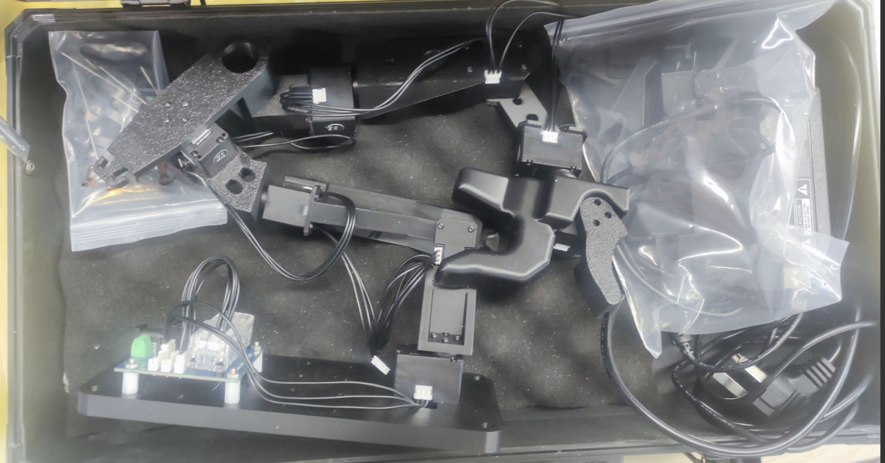
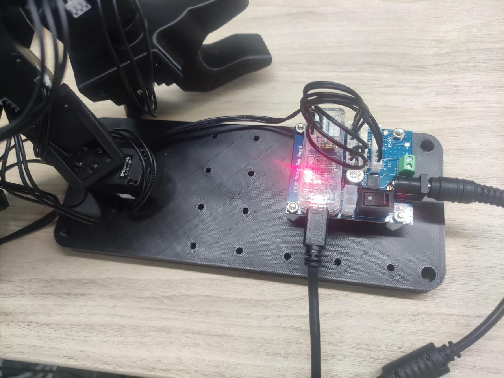
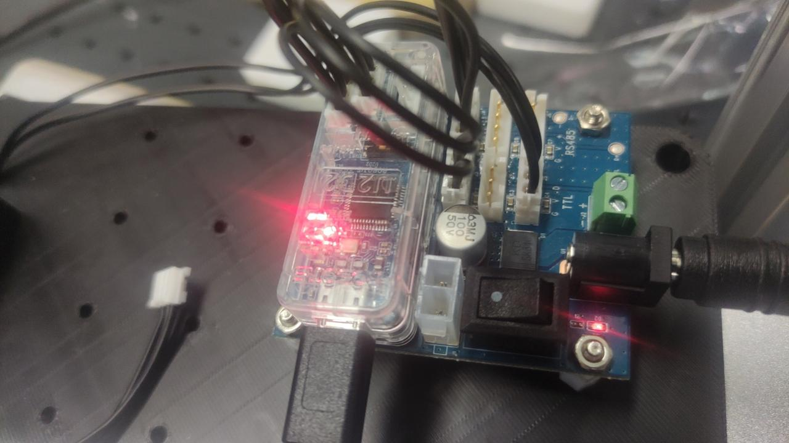
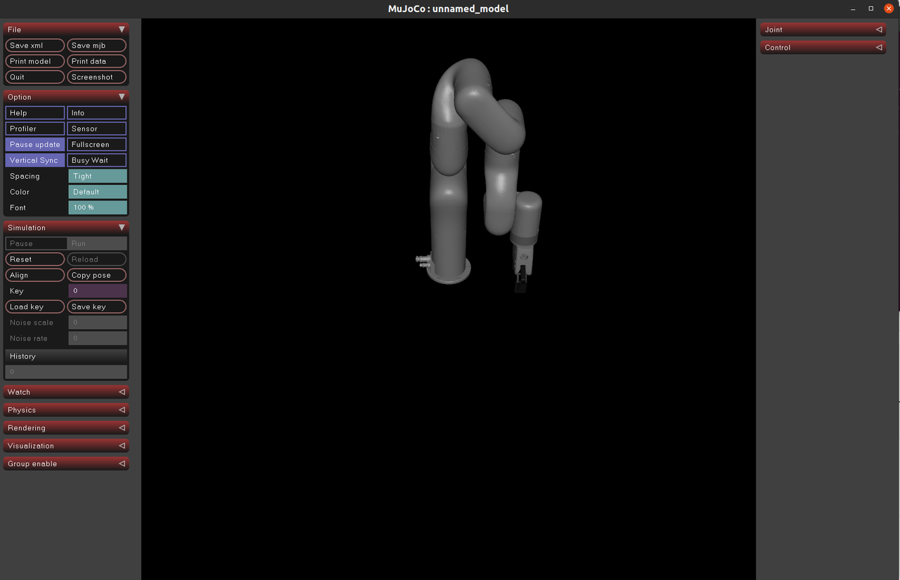
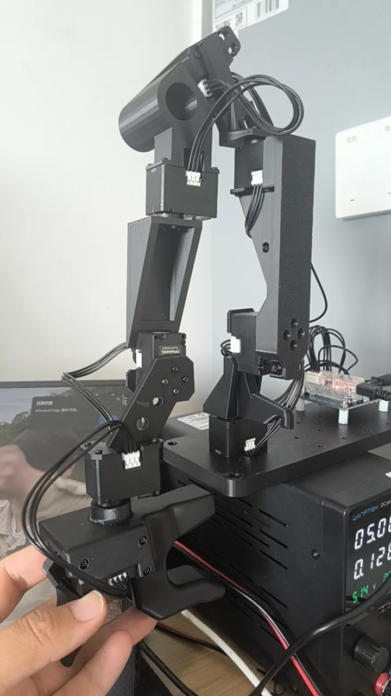

# Hardware
## leader: gello
## follower: xarm 7
## simulation: mujoco







# conda
```
conda create -n gello python=3.8 -y
```
```
conda activate gello
```
# Install 
```
sudo apt-get update
sudo apt-get install redis-server
pip install redis
```
```
git clone —recursive https://github.com/ChangerC77/gello_software-main.git
cd ~/gello_software-main
git submodule init
git submodule update
pip install -r requirements.txt
```
output
```
Installing collected packages: ur-rtde, pyrealsense2, PyQt6-Qt6, pyopengl, pure-python-adb, glfw, dm-tree, zipp, xarm-python-sdk, xarm, urllib3, typing-extensions, tqdm, termcolor, shtab, pyzmq, PyQt6-sip, pyparsing, pygments, pygame, pycparser, protobuf, Pillow, numpy, mdurl, lxml, idna, eval-type-backport, etils, docstring-parser, charset_normalizer, certifi, absl-py, zmq, scipy, requests, quaternion, pyquaternion, PyQt6, numpy-quaternion, markdown-it-py, labmaze, importlib_resources, importlib-metadata, dm-env, cffi, typeguard, rich, easyhid, tyro, pyspacemouse, mujoco, dm_control
Successfully installed Pillow-10.4.0 PyQt6-6.7.1 PyQt6-Qt6-6.7.3 PyQt6-sip-13.8.0 absl-py-2.3.0 certifi-2025.6.15 cffi-1.17.1 charset_normalizer-3.4.2 dm-env-1.6 dm-tree-0.1.8 dm_control-1.0.23 docstring-parser-0.16 easyhid-0.0.10 etils-1.3.0 eval-type-backport-0.2.2 glfw-2.9.0 idna-3.10 importlib-metadata-8.5.0 importlib_resources-6.4.5 labmaze-1.0.6 lxml-5.4.0 markdown-it-py-3.0.0 mdurl-0.1.2 mujoco-3.2.3 numpy-1.24.4 numpy-quaternion-2023.0.4 protobuf-5.29.5 pure-python-adb-0.3.0.dev0 pycparser-2.22 pygame-2.6.1 pygments-2.19.1 pyopengl-3.1.9 pyparsing-3.1.4 pyquaternion-0.9.9 pyrealsense2-2.55.1.6486 pyspacemouse-1.1.4 pyzmq-27.0.0 quaternion-3.5.2.post4 requests-2.32.4 rich-14.0.0 scipy-1.10.1 shtab-1.7.2 termcolor-2.4.0 tqdm-4.67.1 typeguard-4.4.0 typing-extensions-4.13.2 tyro-0.9.24 ur-rtde-1.6.1 urllib3-2.2.3 xarm-0.0.4 xarm-python-sdk-1.15.3 zipp-3.20.2 zmq-0.0.0
```
```
pip install -e .
```
output
```
Installing collected packages: gello
  DEPRECATION: Legacy editable install of gello==0.0.1 from file:///home/robotics/gello_software-main (setup.py develop) is deprecated. pip 25.0 will enforce this behaviour change. A possible replacement is to add a pyproject.toml or enable --use-pep517, and use setuptools >= 64. If the resulting installation is not behaving as expected, try using --config-settings editable_mode=compat. Please consult the setuptools documentation for more information. Discussion can be found at https://github.com/pypa/pip/issues/11457
  Running setup.py develop for gello
Successfully installed gello
```
```
cd ~/gello_software-main
rm -rf third_party/DynamixelSDK
cd third_party & git clone https://github.com/ROBOTIS-GIT/DynamixelSDK.git
pip install -e DynamixelSDK/python
```
output
```
Successfully built pure-python-adb zmq easyhid
Installing collected packages: ur-rtde, PyQt6-Qt6, pure-python-adb, xarm, shtab, quaternion, pyzmq, PyQt6-sip, pygame, pycparser, numpy-quaternion, docstring-parser, zmq, typeguard, PyQt6, cffi, tyro, easyhid, pyspacemouse
Successfully installed PyQt6-6.7.1 PyQt6-Qt6-6.7.3 PyQt6-sip-13.8.0 cffi-1.17.1 docstring-parser-0.16 easyhid-0.0.10 numpy-quaternion-2023.0.4 pure-python-adb-0.3.0.dev0 pycparser-2.22 pygame-2.6.1 pyspacemouse-1.1.4 pyzmq-27.0.0 quaternion-3.5.2.post4 shtab-1.7.2 typeguard-4.4.0 tyro-0.9.24 ur-rtde-1.6.1 xarm-0.0.4 zmq-0.0.0
Obtaining file:///home/robotics/gello_software
  Preparing metadata (setup.py) ... done
Requirement already satisfied: numpy in /home/robotics/miniconda3/envs/real/lib/python3.8/site-packages (from gello==0.0.1) (1.23.5)
Installing collected packages: gello
  DEPRECATION: Legacy editable install of gello==0.0.1 from file:///home/robotics/gello_software (setup.py develop) is deprecated. pip 25.0 will enforce this behaviour change. A possible replacement is to add a pyproject.toml or enable --use-pep517, and use setuptools >= 64. If the resulting installation is not behaving as expected, try using --config-settings editable_mode=compat. Please consult the setuptools documentation for more information. Discussion can be found at https://github.com/pypa/pip/issues/11457
  Running setup.py develop for gello
Successfully installed gello
Obtaining file:///home/robotics/gello_software/third_party/DynamixelSDK/python
  Preparing metadata (setup.py) ... done
Collecting pyserial (from dynamixel_sdk==3.7.51)
  Downloading pyserial-3.5-py2.py3-none-any.whl.metadata (1.6 kB)
Downloading pyserial-3.5-py2.py3-none-any.whl (90 kB)
Installing collected packages: pyserial, dynamixel_sdk
  DEPRECATION: Legacy editable install of dynamixel_sdk==3.7.51 from file:///home/robotics/gello_software/third_party/DynamixelSDK/python (setup.py develop) is deprecated. pip 25.0 will enforce this behaviour change. A possible replacement is to add a pyproject.toml or enable --use-pep517, and use setuptools >= 64. If the resulting installation is not behaving as expected, try using --config-settings editable_mode=compat. Please consult the setuptools documentation for more information. Discussion can be found at https://github.com/pypa/pip/issues/11457
  Running setup.py develop for dynamixel_sdk
Successfully installed dynamixel_sdk pyserial-3.5
```
# port
```
ls /dev/serial/by-id/usb-FTDI_USB__-__Serial_Converter_FTAA08CH-if00-port0
```
output
```
/dev/serial/by-id/usb-FTDI_USB__-__Serial_Converter_FTAA08CH-if00-port0
```
```
sudo chmod 777 /dev/serial/by-id/usb-FTDI_USB__-__Serial_Converter_FTAA08CH-if00-port0
```
# redis
## start
```
sudo service redis-server start
```
## verify
```
redis-cli ping
```
若输出PONG，则说明Redis服务已成功启用并可以正常使用
output
```
PONG
```
# Using GELLO to control a robot!
## sim
### mujoco
```
cd ~/gello_software-main
python experiments/launch_nodes.py --robot sim_xarm
```
output
```
Timeout in ZMQLeaderServer serve
```


按照sim里的机器人状态去调整Gello设备的姿态



### launch your GELLO (the controller node).
```
cd ~/gello_software-main
python experiments/run_env.py --agent=gello
```
You should be able to use GELLO to control the simulated robot!
output
```
/home/robotics/system/miniconda3/envs/gello/lib/python3.8/site-packages/tyro/_parsers.py:347: UserWarning: The field `robot-type` is annotated with type `<class 'str'>`, but the default value `None` has type `<class 'NoneType'>`. We'll try to handle this gracefully, but it may cause unexpected behavior.
  warnings.warn(message)
Found 1 ports
using port /dev/serial/by-id/usb-FTDI_USB__-__Serial_Converter_FTAA08CH-if00-port0
attempting to connect to port: /dev/serial/by-id/usb-FTDI_USB__-__Serial_Converter_FTAA08CH-if00-port0
Going to start position

joint[4]:          delta: 6.303 , leader:         -6.303 , follower:         0.000
joint[6]:          delta: 6.262 , leader:         6.262 , follower:         0.000
```
输出显示`[4]`和`[6]`有问题

```
python  ~/gello_software-main/scripts/gello_get_offset.py         
```
output
```
best offsets               :  ['4.712', '3.142', '6.283', '0.000', '0.000', '1.571', '9.425']
best offsets function of pi: [3*np.pi/2, 2*np.pi/2, 4*np.pi/2, 0*np.pi/2, 0*np.pi/2, 1*np.pi/2, 6*np.pi/2 ]
gripper open (degrees)        183.051953125
gripper close (degrees)       141.251953125
```
将`best offsets function of pi`里`*np.pi/2`前面的系数修改到代码里
```
PORT_CONFIG_MAP: Dict[str, DynamixelRobotConfig] = {
    #xArm
    "/dev/serial/by-id/usb-FTDI_USB__-__Serial_Converter_FTAA08CH-if00-port0": DynamixelRobotConfig(
        joint_ids=(1, 2, 3, 4, 5, 6, 7),
        joint_offsets=(
            3 * np.pi / 2,
            2 * np.pi / 2,
            4 * np.pi / 2,
            0 * np.pi / 2,
            0 * np.pi / 2,
            1 * np.pi / 2,
            6 * np.pi / 2,
        ),
        joint_signs=(1, 1, 1, 1, 1, 1, 1),
        gripper_config=(8, 185, 145),#这里不要改
    )
}
```
然后再次执行命令
```
cd ~/gello_software-main
python experiments/run_env.py --agent=gello
```
output
```
/home/robotics/system/miniconda3/envs/gello/lib/python3.8/site-packages/tyro/_parsers.py:347: UserWarning: The field `robot-type` is annotated with type `<class 'str'>`, but the default value `None` has type `<class 'NoneType'>`. We'll try to handle this gracefully, but it may cause unexpected behavior.
  warnings.warn(message)
Found 1 ports
using port /dev/serial/by-id/usb-FTDI_USB__-__Serial_Converter_FTAA08CH-if00-port0
attempting to connect to port: /dev/serial/by-id/usb-FTDI_USB__-__Serial_Converter_FTAA08CH-if00-port0
Going to start position
Start pos: 8 Joints: 8

Start 🚀🚀🚀
Time passed: 99.24
```
此时可以控制`mujoco`中的xarm了

## Real
### start xarm
```
cd ~/gello_software-main
python experiments/launch_nodes.py --robot=xarm
```
### gello control
gello与实物机械臂尽可能保持一致
```
python experiments/run_env.py --agent=gello
```